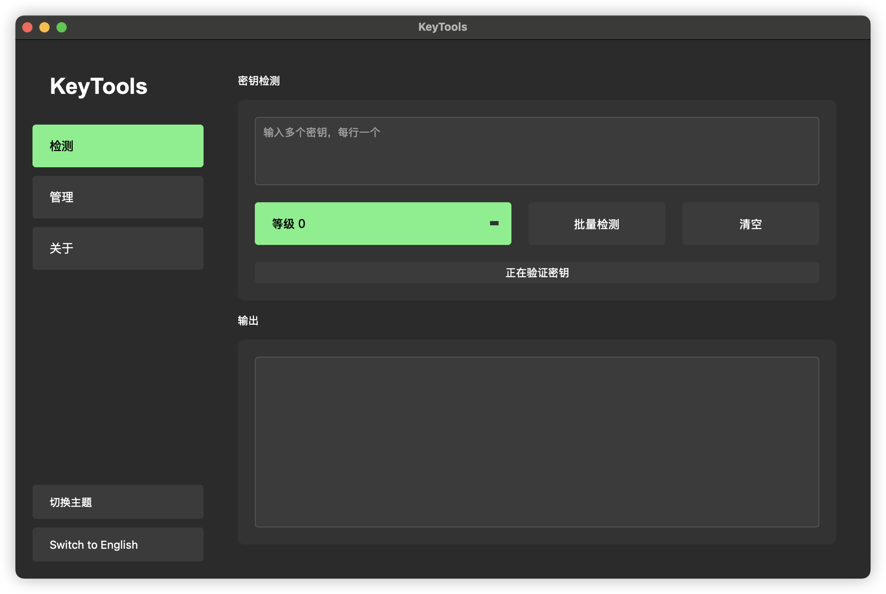
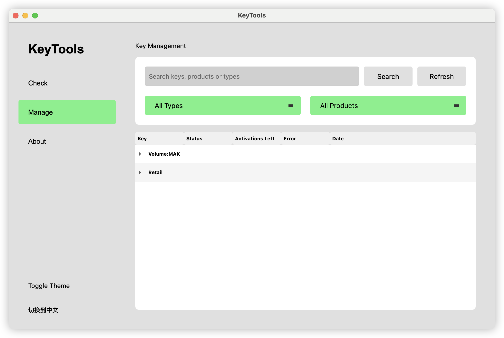

# KeyTools - 专业密钥验证与管理工具

<div align="center">

</div>

[English](#english) | [中文](#中文)

<a name="english"></a>

## 🔑 KeyTools - Professional Key Verification and Management Tool

KeyTools is a powerful Microsoft product key verification and management tool. It provides batch detection, multi-level validation strategies (to save activation count), MAK remaining activation query, and comprehensive key management functions.

### ✨ Features

- **Multiple Verification Levels**: Choose verification intensity to save activation attempts
- **Batch Key Verification**: Process multiple keys in one operation
- **Key Management**: Organize keys by type and product
- **MAK Query**: Check remaining activations for MAK keys
- **Modern Interface**: Clean UI with dark/light theme support
- **Multi-language**: Supports English and Chinese

### 🔧 Installation

1. Download the appropriate version for your system:
   - **macOS ARM64**: `KeyTools_ARM64.dmg`
   - **macOS Intel**: `KeyTools_Intel.dmg` 
   - **Windows**: `keytools.exe`

2. **⚠️ IMPORTANT: First-Time Setup**

   For the application to function correctly, you need to manually copy the configuration files:

   1. **First, launch the application** 
   2. **Go to the "About" tab** in the application
   3. **Click on the configuration path** shown in the About page to open the folder
   4. **Copy the `pkeyconfigs` folder** into this location
   
   **Configuration paths:**
   
   **For Windows:**
   ```
   %APPDATA%\KeyTools\config\
   ```

   **For macOS:**
   ```
   ~/Library/Application Support/KeyTools/config/
   ```

   > ℹ️ The application will NOT function correctly without these configuration files!

### 📖 Usage

1. **Key Verification**:
   - Enter product keys in the "Check" tab (one key per line)
   - Select verification level (0-2)
   - Click "Batch Check" to verify

2. **Key Management**:
   - View all verified keys in the "Manage" tab
   - Search and filter keys by type or product
   - Right-click any key to copy or update its status

3. **Settings**:
   - Toggle between dark and light themes
   - Switch between English and Chinese languages

### 🛠️ System Requirements

- **Windows**: Windows 10 or later
- **macOS**: macOS 10.14 (Mojave) or later

### 📥 Download

You can download the latest version of KeyTools from the following sources:

- **GitHub Releases**: [https://github.com/lbjlaq/KeyTools/releases](https://github.com/lbjlaq/KeyTools/releases)
- **Direct Download**:
  - [KeyTools_ARM64.dmg](https://github.com/lbjlaq/KeyTools/releases/download/1.0.0//download/KeyTools_ARM64.dmg) (macOS ARM64)
  - [KeyTools_Intel.dmg](https://github.com/lbjlaq/KeyTools/releases/download/1.0.0//download/KeyTools_Intel.dmg) (macOS Intel)
  - [keytools.exe](https://github.com/lbjlaq/KeyTools/releases/download/1.0.0//download/keytools.exe) (Windows)

### ⚠️ Disclaimer

- This tool is provided for educational and verification purposes only.
- KeyTools is not affiliated with, endorsed by, or in any way officially connected with Microsoft Corporation.
- The verification of Microsoft product keys is done to help users confirm the legitimacy of their purchased licenses.
- Users should only verify keys they legally own or have permission to verify.
- The developers of KeyTools take no responsibility for any misuse of this tool or violation of any terms of service.
- Use of this software is at your own risk.

---

<a name="中文"></a>

## 🔑 KeyTools - 专业密钥验证与管理工具

KeyTools是一款功能强大的微软产品密钥验证和管理工具。它提供批量检测、多级验证策略（节省激活次数）、MAK剩余激活次数查询，以及全面的密钥管理功能。

### ✨ 功能特点

- **多级验证策略**：选择验证强度，节省激活次数
- **批量密钥验证**：一次操作处理多个密钥
- **密钥管理**：按类型和产品组织密钥
- **MAK查询**：检查MAK密钥的剩余激活次数
- **现代界面**：清爽UI，支持深色/浅色主题
- **多语言支持**：支持中文和英文

### 🔧 安装

1. 下载适合您系统的版本：
   - **macOS ARM64版**：`KeyTools_ARM64.dmg`
   - **macOS Intel版**：`KeyTools_Intel.dmg`
   - **Windows版**：`keytools.exe`

2. **⚠️ 重要：首次运行设置**

   为了使应用程序正常运行，您需要手动复制配置文件：

   1. **首先启动应用程序**
   2. **转到应用程序中的"关于"标签页**
   3. **点击关于页面上显示的配置路径**以打开文件夹
   4. **将`pkeyconfigs`文件夹**复制到此位置
   
   **配置文件路径：**
   
   **Windows系统：**
   ```
   %APPDATA%\KeyTools\config\
   ```

   **macOS系统：**
   ```
   ~/Library/Application Support/KeyTools/config/
   ```

   > ℹ️ 没有这些配置文件，应用程序将无法正常运行！

### 📖 使用说明

1. **密钥验证**：
   - 在"检测"标签页输入产品密钥（每行一个）
   - 选择验证级别（0-2）
   - 点击"批量检测"进行验证

2. **密钥管理**：
   - 在"管理"标签页查看所有已验证密钥
   - 通过类型或产品搜索和筛选密钥
   - 右键点击任意密钥以复制或更新其状态

3. **设置**：
   - 切换深色和浅色主题
   - 在中文和英文之间切换语言

### 🛠️ 系统要求

- **Windows**：Windows 10或更高版本
- **macOS**：macOS 10.14 (Mojave)或更高版本

### 📥 下载

您可以从以下来源下载KeyTools的最新版本：

- **GitHub发布页面**：[https://github.com/lbjlaq/KeyTools/releases](https://github.com/lbjlaq/KeyTools/releases)
- **直接下载链接**：
  - [KeyTools_ARM64.dmg](https://github.com/lbjlaq/KeyTools/releases/download/1.0.0/KeyTools_ARM64.dmg) (macOS ARM64版)
  - [KeyTools_Intel.dmg](https://github.com/lbjlaq/KeyTools/releases/download/1.0.0/KeyTools_Intel.dmg) (macOS Intel版)
  - [keytools.exe](https://github.com/lbjlaq/KeyTools/releases/download/1.0.0/keytools.exe) (Windows版)

### ⚠️ 免责声明

- 本工具仅提供用于教育和验证目的。
- KeyTools与微软公司没有任何关联，也未得到微软公司的认可或官方连接。
- 对微软产品密钥的验证是为了帮助用户确认其已购买许可证的合法性。
- 用户应只验证他们合法拥有或有权验证的密钥。
- KeyTools的开发者对本工具的任何滥用或违反任何服务条款的行为不承担责任。
- 使用本软件的风险由您自行承担。

---

## 📸 Screenshots / 截图




## 📝 License / 许可证

© 2025 Ctrler. All rights reserved. / 版权所有 